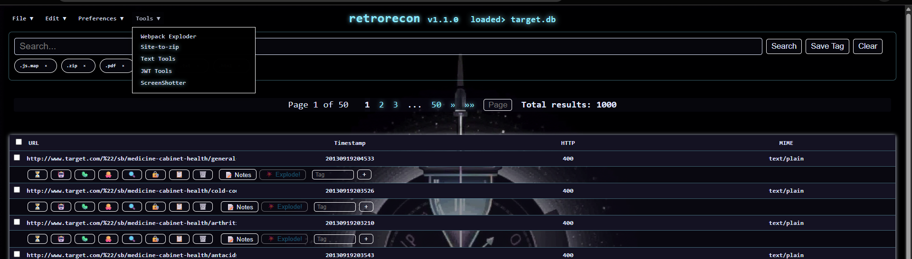

# 🕶️⌛ RetroRecon


A Flask web application for exploring Wayback Machine data and analyzing HAR files. It fetches CDX records, imports HAR archives, stores them in SQLite, and provides a UI to search, tag and manage the results.





**Timeline Analysis. OSINT Archeology.**  
RetroRecon digs through the internet’s attic to find forgotten, buried, or quietly updated web assets using the [Wayback Machine](https://archive.org/web/) and other archival data sources. It's built to help hackers, researchers, and digital historians reconstruct timelines, compare file changes, and extract secrets from the past.

---

## 🔦 What It Does (At a Glance)

- 🔍 **Crawls archived URLs** from the Wayback Machine (via CDX API)
- 📊 **Imports HAR files** for browser traffic analysis and performance monitoring
- �️ **Groups and filters results** by file type, timestamp, tags, or path
- 🧾 **Extracts & analyzes source maps** and JavaScript files for secrets
- 📁 **Saves everything locally** for offline inspection and auditing
- 🔍 **Flags suspicious patterns**, such as leaked API keys, environment files, and exposed `.map` files

---

## 🕵️ Use Cases

- **Security Research** – Discover forgotten `.env` files, exposed sourcemaps, or previously public endpoints
- **OSINT Investigations** – Build a historical snapshot of a domain or identify deleted content
- **Digital Forensics** – Trace changes in a site's frontend or backend over time
- **Web Development Post-Mortems** – Compare JavaScript bundles, audit version regressions, and timeline UI changes
- **Browser Traffic Analysis** – Import and analyze HAR files from browser debugging sessions
- **Performance Monitoring** – Study request patterns, response times, and identify slow endpoints

---

## 🔍 Features

| Feature                        | Description                                                                 |
|-------------------------------|-----------------------------------------------------------------------------|
| Wayback Archive Indexing      | Pulls structured snapshots via CDX API                                     |
| HAR File Import               | Import and analyze HTTP Archive files with full request/response details   |
| Local Source Map Extraction   | Finds and restores `.map` files for easier JS debugging                     |
| Suspicious Pattern Detection  | Scans downloaded files for API keys, JWTs, secrets, etc.                   |
| Filtering & Grouping          | Smart filters by type (e.g., `.js`, `.env`, `.php`, `.map`, etc.)          |
| HTML Report Output (WIP)      | Generate browsable summaries with tagged snapshots and visual comparisons  |
| Dynamic Rendering API         | Programmatically render pages from schemas with managed assets             |
| OCI Registry Table Explorer   | Browse container images as tables with direct download links |
| HTTPolaroid Snapshots         | Capture a single URL with full headers, screenshot and assets into a zip |
| Markdown Editor               | Edit and preview project docs with a resizable editor |
| Domain Sort (Subdomain View)  | Recursively group hosts by root domain |
| Time Zone Flexibility         | `mcp/time` understands IANA and Windows zone names |
| MCP Configuration UI          | Manage Model Context Protocol servers through a web interface with hot-reload |

---

## ⏱️ Quickstart

### IMPORTANT! READ ME
Windows: MCP Servers using stdio need the full path to the command interpreter!
Python = `venv\\Scripts\\python.exe`
npx = `C:\\Program Files\\nodejs\\npx.exe`  

```bash
git clone https://github.com/thesavant42/retrorecon.git
cd retrorecon
pip install -r requirements.txt

# Start crawling a domain
python retrorecon.py --domain example.com
```

Use `--help` to view available options for filtering, exporting, and source map analysis.

## 🖥️ Running the Web Interface

Launch the Flask UI with the provided scripts. Edit `launch_config.example.json` (copy to `launch_config.json`) to adjust the listening address or database path.

```bash
./launch_app.sh            # Linux/macOS
.\launch_app.bat           # Windows
```

These scripts export `RETRORECON_LISTEN` so `app.py` binds accordingly.
**Never expose the app publicly without proper hardening.**

### Vendored MCP SQLite Server

`launch_app.sh` and `launch_app.bat` previously started the vendored Model
Context Protocol server. This logic now lives inside the Flask application.
Whenever a database is loaded or switched RetroRecon uses the built-in
`RetroReconMCPServer` class pointing at the active database. No external
process is launched; all communication happens directly in Python.

You may mention in your system prompt that an MCP server is available within
the application for executing safe SQL queries against the current database.

If dependency installation fails, delete the virtual environment directory and
rerun the launch script.

For a quick walkthrough of the common workflow see
[docs/new_user_guide.md](docs/new_user_guide.md).

### MCP Server Configuration

External MCP services are defined in a central `mcp_servers.json` file. The
application loads this file from the project root by default or from the path
specified by the `RETRORECON_MCP_SERVERS_FILE` environment variable. Each entry
describes the server name, transport type and connection details. The built-in
MCP manager starts any enabled services automatically when a database is loaded.

### Capture a Snap

The **HTTPolaroid** tool can be triggered from the UI under `Tools → Active Recon`. It fetches a URL in a headless browser, follows redirects and saves the page, assets, headers and screenshot into a single zip file for download.

### Import HAR Files

RetroRecon supports importing HTTP Archive (HAR) files to analyze browser traffic, performance metrics, and request patterns. HAR files contain detailed information about web requests including:

- Request/response headers, methods, and status codes
- Response times and performance metrics
- MIME types and content information
- Full request/response bodies

#### How to Import HAR Files

1. **Generate HAR File**: Export from browser DevTools (F12 → Network → Export HAR)
2. **Import via UI**: Click `Tools → Import JSON/HAR File` and select your `.har` file
3. **Background Processing**: Large HAR files are processed in the background with progress tracking
4. **View Results**: HAR entries appear with orange "HAR" badges in the Source column

#### HAR-Specific Features

- **Enhanced Columns**: Method, Timestamp, HTTP Status, MIME Type, Response Time (ms), Source Type
- **Smart Filtering**: Use filter pills like "HAR Only", "POST", "2xx", "4xx+", "Slow" for quick analysis
- **Performance Analysis**: Identify slow requests (>1s response time) and error responses
- **Request Method Analysis**: Filter by GET, POST, PUT, DELETE, etc.
- **Status Code Grouping**: Quickly find 2xx successes, 4xx client errors, or 5xx server errors

#### Supported HAR Format

RetroRecon supports the HAR 1.2 specification and extracts the following data from each entry:

```json
{
  "log": {
    "entries": [
      {
        "request": {
          "method": "GET|POST|PUT|DELETE|...",
          "url": "https://example.com/api/endpoint"
        },
        "response": {
          "status": 200,
          "content": {
            "mimeType": "application/json"
          }
        },
        "time": 150,
        "startedDateTime": "2023-01-01T12:00:00.000Z"
      }
    ]
  }
}
```

#### Search and Filter HAR Data

- **Source Filter**: `source_type:"har"` - Show only HAR-imported entries
- **Method Filter**: `request_method:"POST"` - Filter by HTTP method
- **Status Filter**: `status_code:>=400` - Find error responses
- **Performance Filter**: `response_time_ms:>1000` - Find slow requests
- **Combined Filters**: `source_type:"har" AND status_code:>=400` - HAR errors only

---

## 🕶️ Philosophy

RetroRecon isn’t just about scraping old URLs. It’s about **investigating time** — tracing the evolution of a site’s public footprint and finding what was exposed *when*. Think of it as a tool to:
> _"Reconstruct the past to understand the present. And maybe… exploit the future."_

---

## 🗃️ Project Layout

```
retrorecon/
├── retrorecon.py         # Main CLI interface
├── cdx.py                # Wayback CDX API logic
├── extract.py            # Source map and secrets extraction
├── utils/                # Helpers and formatters
├── static/               # CSS and JS for reports
└── templates/            # Jinja2 templates for report generation
```

---

## 🔍 Sample Output

Coming soon – screenshots of the report interface and extraction logs.

---

## 🔧 MCP Configuration Management

RetroRecon includes a built-in web interface for managing Model Context Protocol (MCP) servers. This feature allows you to:

- **View server status** - See which MCP servers are running/stopped
- **Edit configurations** - Modify server settings without editing files
- **Add/remove servers** - Dynamically manage your MCP server lineup
- **Hot-reload** - Apply changes without restarting the application

### Supported Transport Types

- **SSE (Server-Sent Events)** - For real-time streaming connections
- **HTTP** - Standard HTTP-based communication
- **Stdio** - Direct process communication via stdin/stdout

### Access the Interface

1. Navigate to RetroRecon in your browser
2. Click **Tools** → **MCP Configuration**
3. View current server status and edit configurations
4. Click **Save Configuration** to apply changes with hot-reload

### Configuration Examples

**SSE Server:**
```json
{
  "name": "fetch",
  "transport": "sse",
  "url": "http://127.0.0.1:3000/sse",
  "enabled": true,
  "lazy_start": true
}
```

**Stdio Server:**
```json
{
  "name": "memory",
  "transport": "stdio", 
  "command": ["python", "-m", "mcp_memory_server"],
  "enabled": true,
  "lazy_start": false
}
```

---

## ⏱️ Roadmap

- [ ] Full HTML reporting interface (Wayback snapshot explorer)
- [ ] Timeline diff view between asset versions
- [ ] Plugin system for custom extractors (e.g., Postman collections, GraphQL introspection)
- [ ] Integration with `jodskeys` and `darkwing_dox`

---

## 🕶️ Author

**savant42** – Veteran red teamer. Builder of weird tools.  
Reach me through [GitHub Discussions](https://github.com/thesavant42/retrorecon/discussions) or post an Issue.

---

## 📜 License

MIT License. Use it. Abuse it. Just don’t sell it back to me.
