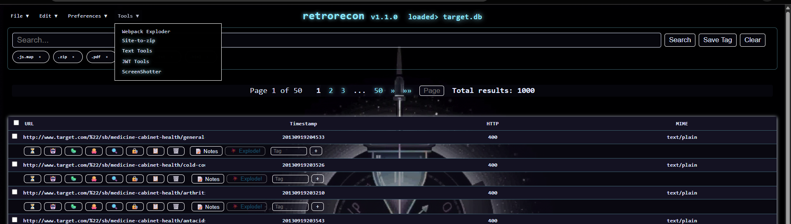

# retrorecon

A Flask web application for exploring Wayback Machine data. It fetches CDX records, stores them in SQLite, and provides a UI to search, tag and manage the results.





## Project Home
<https://github.com/thesavant42/retrorecon>

## GitHub Releases & Topics

Versioned releases are tracked using annotated Git tags prefixed with `v` (for example `v1.1.0`).
Run the `Release` workflow or manually create a new tag to publish a release.

On GitHub, apply the topics `flask`, `wayback-machine`, `sqlite` and `python` to help others discover this project.

## Background

Time spent on reconaissance pays off in silence on the wire when it counts. In terms of packet economy, nothing beats free. And the Internet Archive's Wayback Machine is free (as in beer) as can be, so let's utilize it.

The Wayback Machine crawls all sorts of sites, but their primary search interface doesn't allow for wildcard matches left-of-domain; if you don't know the subdomain already, you're out of luck. You could brute force it (noisy) or guess (sad/lucky), or you could ask someone who already knows.

The Wayback Machine CDX API allows us to search for `*.example.com` and will return results for `www.example.com/123` but also `dev.example.com/abc` and `old.internal.corp.example.com`; DNS subdomain enumeration for free.

But savant, you ask, so what? Who gives a hoot about old data? 

Great question. Subdomains don't change as often as IP addresses do, so they're likely to still be relevant or at least historically interesting. Exploit Genealogy. Also, by learning from the mistakes of the past, we can hope to avoid them in the future. But really, we can more probably predict them, or find where they still are.

System names and subdomains, internal hostnames, etc, can reveal their function, or design intention. ZIP files containing internal tooling and meant for internal distribution but unintentionally indexed. IDOR vulnerabilities, JWTs and application tokens revealed in GET request strings... For free. Why wouldn't you want to at least take a look?

## Problem Statement

The CDX API is powerful but not particularly robust and not the fastest, and a single query often returns multiple-hundred megabyte responses. This can slow down research, but it also creates unecessary strain on the CDX API servers.

## Solution?

 `retrorecon` attempts to ease that pain by enabling offline storage of the CDX records in a local sqlite database, to allow for tagging, sorting, and searching of Wayback CDX records.

## Features
- **CDX import** from the Wayback Machine API
- **JSON import** of URL lists or records
- Background import with progress indicator
- Search and filter by text and tags, including Boolean tag expressions like `#blue AND #tag1`
- Inline and bulk tag management
- Bulk actions with "select all visible" or "select all matching"
- Quick OSINT links for each URL (Wayback, Shodan, VirusTotal, Google, GitHub, crt.sh)
- Download, load or create databases from the menu, including naming your new
  database
- Rename the current database without leaving the application
- Remembers and reloads the most recently used database on launch
- Theme switching via Menu dropdown with optional background image toggle
- Optional theming via CSS files in `static/themes/`, including a dark OpenAI-inspired style and hundreds of Midnight City combinations (generated via `scripts/generate_midnight_themes.py`)
- Browser-side search history for quick queries
- Pagination with jump-to-page and total counts
- Webpack Exploder: input a `.js.map` URL and download a ZIP of the sources
- **Text Tools** full-screen editor for Base64 and URL encoding/decoding with Save As
- **JWT Tools** decode, edit and sign JSON Web Tokens inside a full-screen editor
-  with a persistent JWT cookie jar
- **ScreenShotter** capture website screenshots in a headless browser (requires `playwright`; falls back to a Pillow placeholder)
- **Site2Zip** crawl a URL, generate a sitemap and download all assets as a ZIP
- **LayerPeek** inspect Docker image layers from Docker Hub
- Save favorite tag searches for quick reuse
- Adjustable panel opacity and font size
- Add notes to each URL result via a full-screen editor

## Installation
```bash
pip install -r requirements.txt
# Recommended: install Playwright browsers
# python -m playwright install
python scripts/init_db.py  # initialize wabax.db
python app.py
# Optionally set RETRORECON_DB to open a specific database on launch
# RETRORECON_DB=dsprings.db python app.py
# Enable verbose logging by setting RETRORECON_LOG_LEVEL
# RETRORECON_LOG_LEVEL=DEBUG python app.py
```
On Windows you can run `launch_app.bat` to automatically update the repository,
set up a `venv` and start the server:

```cmd
launch_app.bat
```
Then open <http://127.0.0.1:5000> in your browser.
### Playwright on Windows
If screenshot capture shows a placeholder image, Playwright may not have the Chromium browser installed.
Run `python -m playwright install` to download the browsers. If you previously
set the `PLAYWRIGHT_BROWSERS_PATH` environment variable, remove it so Playwright
can use its default location. Alternatively set `PLAYWRIGHT_CHROMIUM_PATH` to an
existing Chrome executable. You can also assign a path to `app.executablePath`
before calling screenshot functions to override the Chromium binary.

### Docker Quick Start

Build the container image:

```bash
docker build -t retrorecon .
```

Run it with shared folders so imports and exports persist on the host:

```bash
docker run -p 5000:5000 \
  -v "$PWD/db:/app/db" \
  -v "$PWD/data:/app/data" \
  -v "$PWD/static/screenshots:/app/static/screenshots" \
  retrorecon
```

The mounted volumes store databases, uploaded files and screenshots outside
the container.

## Usage
1. **Import from CDX**: enter a domain to fetch URLs from the Wayback API.
2. **Import from JSON**: upload a JSON file containing URLs or full CDX records.
3. Use the search box and tag filters to narrow results.
4. Add or remove tags individually or use the bulk actions.
5. Save the current database, load another or start a new one (and give it a
   name) using the menu. You can also rename the active database from the same
   dropdown.
6. When you relaunch the app, it automatically reloads the last database you used.
7. Save frequent tag searches with the **Save Tag** button or via the `/saved_tags` API.
8. Adjust panel opacity and text size from the **Edit** menu or using the `/set_panel_opacity` and `/set_font_size` endpoints.

### Boolean Tag Searches

Prefix tags with `#` and combine them using `AND`, `OR` and `NOT` in the search box. Quotes allow tags with spaces.

Example queries:

```bash
curl -G --data-urlencode "q=#tag1 AND #red" http://localhost:5000/
curl -G --data-urlencode "q=#blue OR #red" http://localhost:5000/
curl -G --data-urlencode "q=#\"tag 2\" AND NOT #tag4" http://localhost:5000/
```

### Advanced Search Operators

Use field prefixes to filter on specific attributes and combine them with
boolean logic:

- `url:` – match against the URL
- `timestamp:` – match the archived timestamp
- `http:` – match the HTTP status code
- `mime:` – match the MIME type

Example queries:

```bash
curl -G --data-urlencode "q=url:example.com AND http:200" http://localhost:5000/
curl -G --data-urlencode "q=NOT http:404" http://localhost:5000/
```

### Managing Saved Tags

```bash
# List saved tags
curl http://localhost:5000/saved_tags
# Add a tag query (the leading # is optional)
curl -X POST -d "tag=foo" http://localhost:5000/saved_tags
# Remove a tag query
curl -X POST -d "tag=#foo AND #bar" http://localhost:5000/delete_saved_tag
```

### Adjusting Font Size

```bash
curl -X POST -d "theme=nostalgia.css" -d "size=16" \
  http://localhost:5000/set_font_size
```

### JWT Tools API

```bash
# Decode a JWT
curl -X POST -d "token=eyJhbGciOi..." http://localhost:5000/tools/jwt_decode
# Returns JSON with header and payload plus `exp_readable`, `expired`,
# `alg_warning` and `key_warning` flags.

# Encode and sign a payload
curl -X POST -d "payload={\"sub\":1}" -d "secret=mykey" \
  http://localhost:5000/tools/jwt_encode
```

```bash
# View logged JWT decodes
curl http://localhost:5000/jwt_cookies
```

### Docker LayerPeek API

```bash
curl -G --data-urlencode "image=ubuntu:latest" \
  http://localhost:5000/docker_layers
```
The response includes layer digests and file lists. If the registry
is unreachable or a timeout occurs, the JSON `error` field describes the
problem.

Set `LAYERPEEK_RANGE` to control how many bytes are fetched at a time when
listing layer contents. The default is 2&nbsp;MB which keeps bandwidth usage
low while still decoding most archives.

### Using the `layerslayer` Library

The Docker layer inspection logic is available as an importable library.

```python
from layerslayer.client import gather_layers_info

data = asyncio.run(gather_layers_info("ubuntu:latest"))
print(data[0]["layers"][0]["digest"])
```

## License
MIT

## Attribution
- [Wayback Machine API](https://archive.org/help/wayback_api.php)
- [Webpack Exploder](https://spaceraccoon.github.io/webpack-exploder/)
- [Map Room conceptual inspiration](https://indianajones.fandom.com/wiki/Map_Room)

## Wiki Sync
Markdown files in this repository are automatically mirrored to the
[project wiki](https://github.com/thesavant42/retrorecon/wiki) via the
`update_wiki.py` script. On each push that modifies `.md` files, a GitHub
Actions workflow clones the wiki repository, copies the updated files and
pushes the changes. The workflow expects a repository secret named
`WIKI_PAT` with permissions to push to the wiki repository.
The commit author defaults to `retrorecon-bot <actions@github.com>` but can be
overridden using the `GIT_USER_NAME` and `GIT_USER_EMAIL` environment
variables.

## APPSEC

**THIS CODE IS NOT MEANT TO BE RUN AS A SERVICE OR ON PUBLIC NETWORKS.**

The project is intended for local, offline research only. A recent security
review highlighted several areas that need hardening before any kind of
production deployment. Below is the outstanding task list to improve the
application's security posture.

```markdown
- [ ] Load `app.secret_key` from an environment variable and document the requirement.
- [ ] Implement CSRF protection across all POST forms (consider Flask-WTF).
- [x] Refactor `templates/index.html` to avoid placing `{{ url.url }}` inside JavaScript strings.
  - Use `data-url` attributes and event listeners defined in JS.
  - Sanitize URLs before opening (e.g., verify `http/https`).
- [ ] Validate `map_url` in `/tools/webpack-zip`:
  - Accept only `http`/`https`.
  - Optionally restrict to specific domains or apply a URL whitelist.
- [ ] Validate `domain` input in `/fetch_cdx` using a regex for valid hostnames.
- [ ] Add unit tests ensuring malicious values do not lead to XSS or SSRF.
- [ ] Update deployment configuration to set `SESSION_COOKIE_SECURE` when using HTTPS.
```
