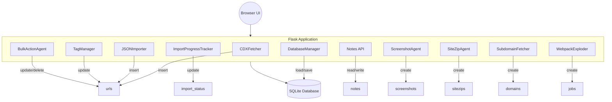
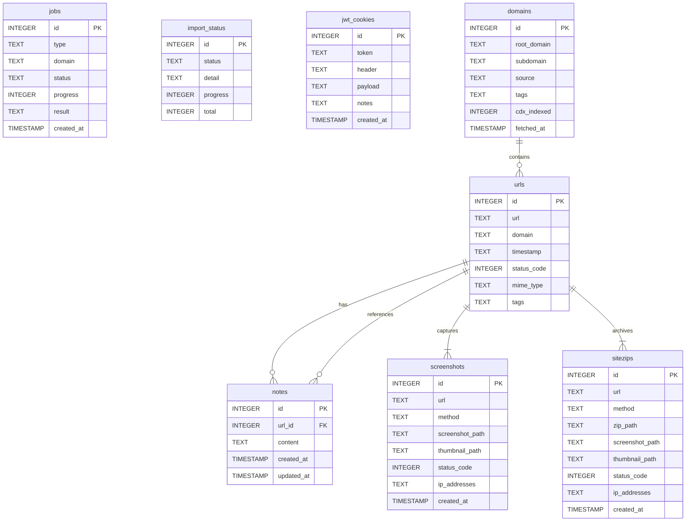

# System Architecture Overview

This document summarizes the major runtime components of Retrorecon and illustrates how the database tables relate to each feature. The diagrams are written in [Mermaid](https://mermaid.js.org/) so they can be rendered directly in Markdown viewers that support it.

The tables themselves are connected via the relationships shown below.

