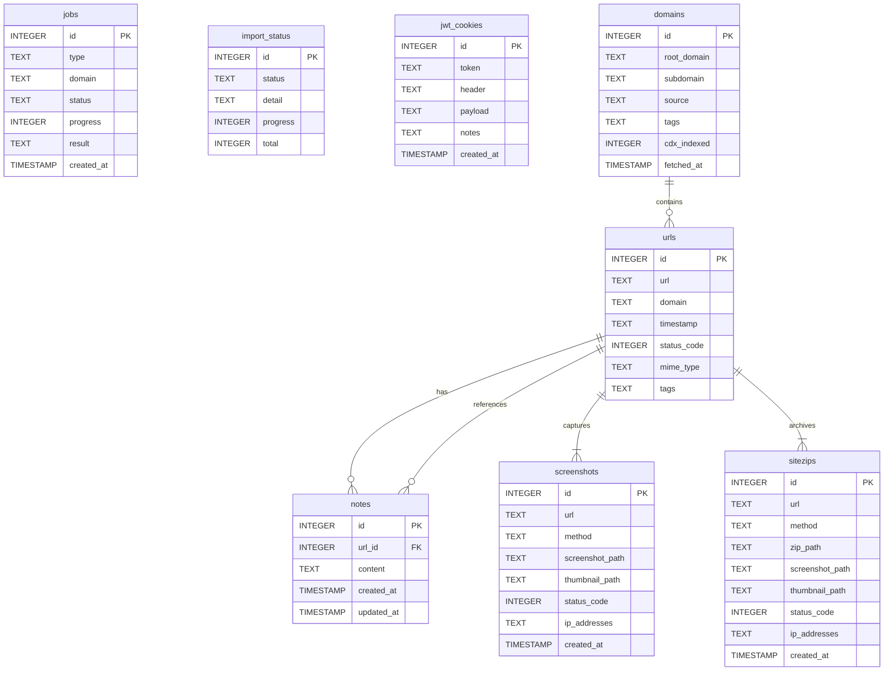

# Database Entity Relationship Diagram

```mermaid
erDiagram
    urls {
        INTEGER id PK
        TEXT url
        TEXT domain
        TEXT timestamp
        INTEGER status_code
        TEXT mime_type
        TEXT tags
    }
    jobs {
        INTEGER id PK
        TEXT type
        TEXT domain
        TEXT status
        INTEGER progress
        TEXT result
        TIMESTAMP created_at
    }
    import_status {
        INTEGER id PK
        TEXT status
        TEXT detail
        INTEGER progress
        INTEGER total
    }
    notes {
        INTEGER id PK
        INTEGER url_id FK
        TEXT content
        TIMESTAMP created_at
        TIMESTAMP updated_at
    }
    jwt_cookies {
        INTEGER id PK
        TEXT token
        TEXT header
        TEXT payload
        TEXT notes
        TIMESTAMP created_at
    }
    screenshots {
        INTEGER id PK
        TEXT url
        TEXT method
        TEXT screenshot_path
        TEXT thumbnail_path
        INTEGER status_code
        TEXT ip_addresses
        TIMESTAMP created_at
    }
    sitezips {
        INTEGER id PK
        TEXT url
        TEXT method
        TEXT zip_path
        TEXT screenshot_path
        TEXT thumbnail_path
        INTEGER status_code
        TEXT ip_addresses
        TIMESTAMP created_at
    }
    domains {
        INTEGER id PK
        TEXT root_domain
        TEXT subdomain
        TEXT source
        TEXT tags
        INTEGER cdx_indexed
        TIMESTAMP fetched_at
    }

    urls ||--o{ notes : has
    urls ||--|{ screenshots : captures
    urls ||--|{ sitezips : archives
    notes }o--|| urls : references
    domains ||--o{ urls : contains
```
